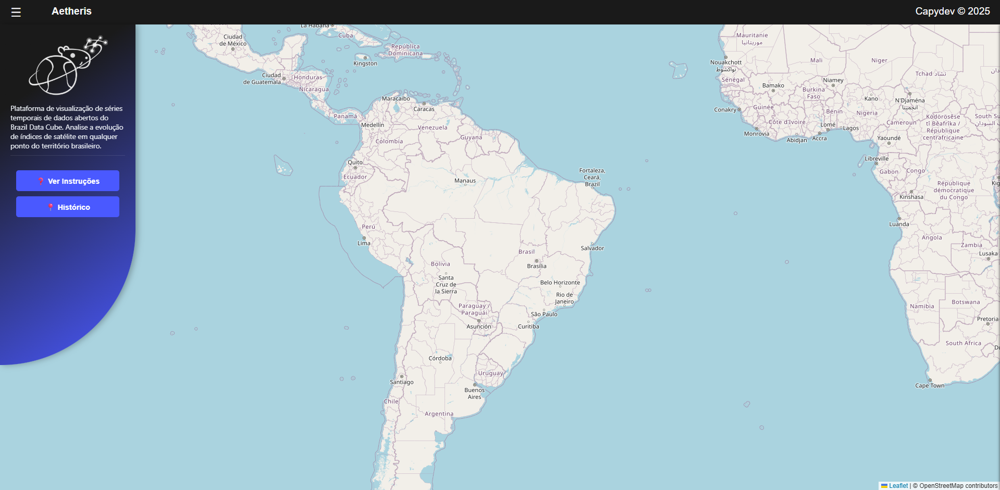

# 🚀 Portfólio — Pedro Henrique Prado


## 📌 Sobre o Projeto

Este projeto é um portfólio pessoal desenvolvido para apresentar minhas habilidades, experiências e projetos na área de desenvolvimento de software.

O site possui um design moderno e responsivo, destacando:

* Informações pessoais e acadêmicas
* Tecnologias dominadas
* Projetos desenvolvidos
* Experiências em ABP
* Formas de contato

O objetivo do portfólio é reunir meus principais trabalhos e demonstrar minha evolução como desenvolvedor.

---

## 👨‍💻 Sobre Mim

Me chamo **Pedro Henrique Prado de Novaes** e sou estudante de **Desenvolvimento de Software Multiplataforma** na **Fatec Jacareí**.

Tenho experiência com desenvolvimento Full Stack utilizando tecnologias modernas como:

* React
* React Native
* TypeScript
* JavaScript
* Node.js
* PostgreSQL
* MongoDB

Além dos projetos acadêmicos, também desenvolvo aplicações pessoais voltadas para mapas interativos, visualização de dados e aplicações web.

---

## 🛠️ Tecnologias Utilizadas

### Frontend

* HTML5
* CSS3
* JavaScript

### Ferramentas e Tecnologias

* Git
* GitHub
* VS Code
* Figma

---

## 📂 Estrutura do Projeto

```bash
📦 portfolio
 ┣ 📂 docs
 ┃ ┣ 📂 imagens
 ┃ ┗ 📂 src
 ┃    ┣ 📜 index.html
 ┃    ┣ 📜 style.css
 ┃    ┗ 📜 script.js
 ┗ 📜 README.md
```

---

## 🎨 Funcionalidades

✅ Layout responsivo
✅ Navegação suave entre seções
✅ Animações e efeitos visuais
✅ Cursor personalizado
✅ Seção de projetos
✅ Seção de contato

---

## 📸 Preview do Projeto

### Página Inicial



---

## 🎥 Vídeo de Apresentação

Confira o vídeo de apresentação do portfólio, onde explico sobre os projetos desenvolvidos, tecnologias utilizadas e minha trajetória acadêmica.

[](https://youtu.be/SEU_VIDEO)


### 📌 Exemplo de incorporação do vídeo

```html
<video controls width="100%">
  <source src="docs/videos/apresentacao.mp4" type="video/mp4">
  Seu navegador não suporta vídeo.
</video>
```

Ou utilizando YouTube:

```html
<iframe 
  width="100%" 
  height="500" 
  src="https://www.youtube.com/embed/SEU_VIDEO" 
  title="Vídeo de apresentação"
  frameborder="0"
  allowfullscreen>
</iframe>
```

---

## 📁 Projetos Destacados

### 🔥 Ignis

Sistema de visualização de dados ambientais com mapas interativos e gráficos utilizando React, Node.js e PostgreSQL.

### 📊 Aetheris

Projeto focado em análise e visualização de dados geográficos e ambientais.

### 📋 CapyScrum

Aplicação voltada para organização de tarefas e gerenciamento ágil.

---

## ▶️ Como Executar o Projeto

### 1. Clone o repositório

```bash
git clone https://github.com/PeedroPrado/ra2581392423035.git
```

### 2. Acesse a pasta do projeto

```bash
cd ra2581392423035
```

### 3. Abra o arquivo `index.html`

Você pode abrir diretamente no navegador ou utilizar a extensão **Live Server** no VS Code.

---

## 🌐 Deploy

O projeto pode ser publicado utilizando:

* GitHub Pages
* Vercel
* Netlify

---

## 📬 Contato

📧 Email: [pedrohenriquepradodenovaes@gmail.com](mailto:pedrohenriquepradodenovaes@gmail.com)
💼 GitHub: [https://github.com/PeedroPrado](https://github.com/PeedroPrado)

---

## 📄 Licença

Este projeto foi desenvolvido para fins acadêmicos e pessoais.
